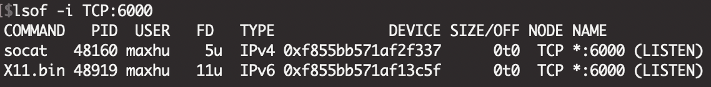
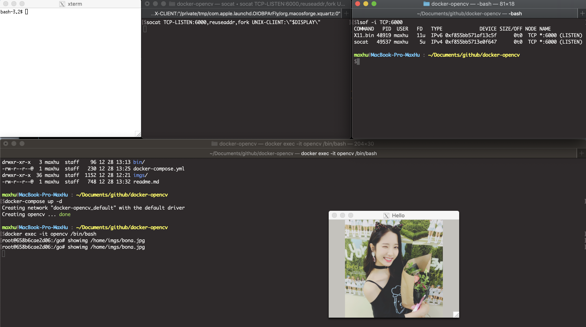

# Synopsis

- Official : https://docs.opencv.org/4.2.0/d7/d9f/tutorial_linux_install.html
- Build opencv in Debian & use gocv to operate it.
	- You could build your app(bin) to work with OpenCV.
	- This repo only supply `./bin/showimg` to help me verify it is workable.
- Please make sure the OpenCV version before you build your own app to work with OpenCV.

# install issue
## Can't generate Makefile
- Please make sure the `OPENCV_EXTRA_MODULES_PATH` is correct.

# How to work with X11

## pre
> 順序重要

1. socat : 用於建立通道
    1. `brew install socat`
    2. `socat TCP-LISTEN:6000,reuseaddr,fork UNIX-CLIENT:\"$DISPLAY\"`
2. xquartz
    1. `brew install Caskroom/cask/xquartz`
    2. `open -a xquartz` 
3. Check tunnel `lsof -i TCP:6000`
    

4. RUN  
    - `docker-compose up -d`
    - `docker exec -it opencv /bin/bash`
    - `showimage /home/imgs/bona.jpg`

